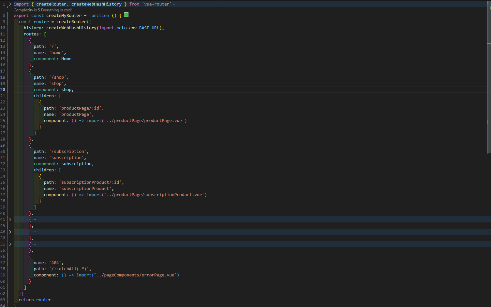
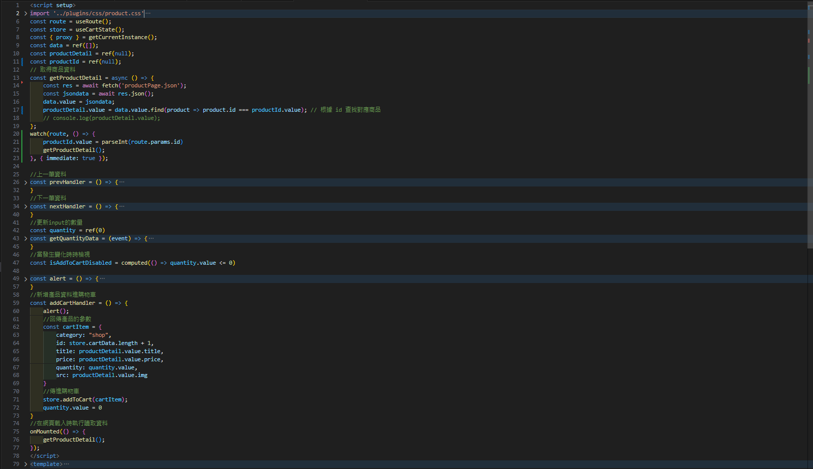
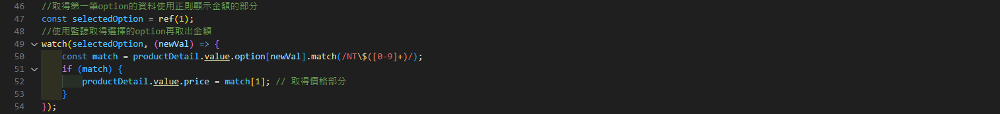
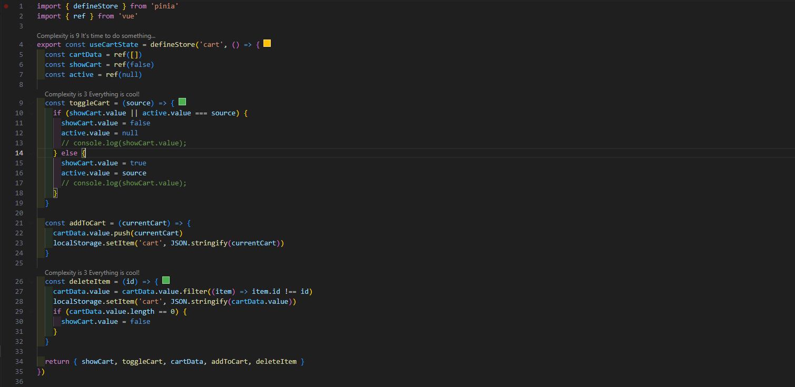

# VUE購物車實作
### 網站樣式:靈感來自 WIX 的範例。重新設計了一個具備相似功能的網站
> [網站Demo](https://i-fishball-i.github.io/vue-training/)
## 網站功能
```
1. 商品瀏覽
2. 添加至購物車
3. 調整數量和刪除商品 
4. 使用 localStorage 保存用戶的購物資料。
```
## 使用的技術
```
1. Bootstrap 5: 用於建立響應式佈局和簡化設計流程。
2. Vue 3: 前端框架，用於管理和渲染動態數據。
```
## Vue Router
```
1. 使用了 Vue Router 來管理組件間的路由，因為網站架在 Github Page上本身沒有 server，所以使用了 createWebHashHistory 模式來設計。
2. Shop、Subscription 底下的子路由，通過動態路由的 params 傳遞產品 ID，並串接 API 從事先建置的 JSON 檔案中提取相應的數據，展示所選產品的詳細資訊。
```


## 產品頁及訂閱項目說明
>產品頁
```
1. fetch 串接API從本地 JSON 文件中提取產品數據，並利用路由參數中的 id 來找到符合的產品，動態顯示資料。
2. watch 來接聽route的變化，發生變化時時時的更改顯示的產品內容。
3. addCartHandler 這函數會紀錄使用者所購買的物品、數量，並將數據透過pinia的方式來管理購物車的資料、狀態。
```

>產品訂閱項
```
1. 產品訂閱因為使用的option的選擇方式，多了正則的使用篩選文字裡所需的特定文字。
```

## Vue Pinia
>狀態管理
```
1. 儲存當前購物車的資料
2. 控制購物車的顯示狀態
3. 記錄當前觸發購物車的來源
```
>功能說明
```
1. toggleCart 用來切換購物車的顯示與否，並在不同來源時關閉上一個，以免重複開啟
2. addToCart 將使用者按下加入購物車時，將資料暫時存放置localStorage
3. deleteItem 則是移除產品時能將所選的產品從localStorage裡移除
```
